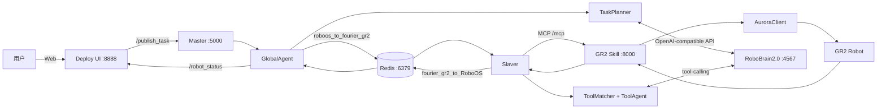

# RoboOS 启动指南

本文档包含了启动 RoboOS 系统及其相关组件的详细命令。

## 终端 1: 启动傅里叶机器人技能服务器

```bash
conda activate fourier-robot
cd ~/workspace/fmc3-robotics/projects/RoboSkill/fmc3-robotics/fourier/gr2
python skill.py
```
## 终端 2: 启动 RoboBrain 模型服务

```bash
conda activate robobrain
cd ~/workspace/fmc3-robotics/projects/RoboBrain2.0
bash startup.sh
```
## 终端 3: 启动 RoboOS Master
```bash
conda activate roboos
cd ~/workspace/fmc3-robotics/projects/RoboOS/master
python run.py
```

## 终端 4: 启动 RoboOS Slaver
```bash
conda activate roboos
cd ~/workspace/fmc3-robotics/projects/RoboOS/slaver
python run.py
```

## 终端 5: 启动网页 (Deploy)
```bash
conda activate roboos
cd ~/workspace/fmc3-robotics/projects/RoboOS/deploy
python run.py
```

## RoboOS 到 GR2 架构图

### 1) 主链路（RoboOS -> MCP Skill -> GR2）



### 2) PI0 原子操作链路（`execute_manipulation_task`）

```mermaid
flowchart LR
    A[任务 pick/place] --> B[Master 原子路由<br/>execute_manipulation_task]
    B --> C[Slaver MCP 调用]
    C --> D[skill_pi0.py]
    D <-->|Unix Socket| E[/tmp/gr2_pi0_inference_service.sock]
    E --> F[gr2_pi0_inference_service.py]
    F --> G[PI0 推理]
    G --> H[GR2 控制]
    H --> I[GR2 Robot]
    I --> D
    D --> C
    C --> B
```
